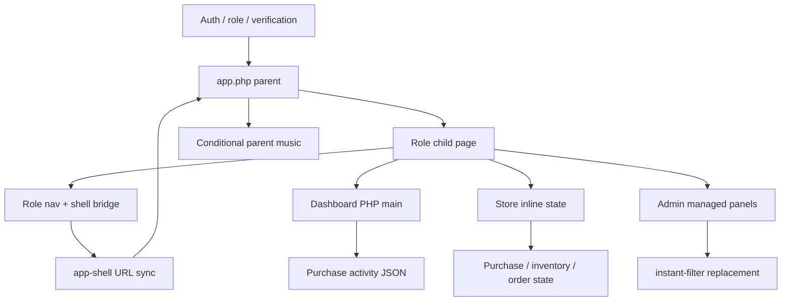

# Sakazuki redesign audit — 2026-09-25

**สถานะ: Source audit package พร้อม review; runtime audit ยังไม่ผ่าน gate. ห้ามเริ่ม UI implementation จากรายงานนี้**

- Source: `main` = `74bb4fc38236bdd5a3ae90477b3e8df82844e9a6`
- Working branch: `redesign/audit-v1`
- Draft PR: https://github.com/aekthai01/sakazuki/pull/21
- GitHub comparison กับ baseline `34b9f2f7a5ae2923fe07bc7a931f5589ceec1a65`: ต่างเฉพาะ Master Plan และ Handoff; rollback commit อยู่ใน ancestry
- ดึง source ผ่าน GitHub connector ตาม commit เดียวกัน 190 ไฟล์และตรวจ Git blob hashes ตรงทั้งหมด ไม่ใช่หลักฐานว่า Production ตรงกับ repo
- ไม่แก้ PHP/JS/CSS, ไม่ merge, ไม่ deploy, ไม่เรียก broad FTP workflow, ไม่ส่งคำสั่ง purchase/wallet/cron บน Production

## ข้อค้นพบหลัก

1. User/Reseller landing คือ Store (`buy.php`) จาก `app.php` และ `auth.php::redirectByRole` จริง Dashboard ใช้เป็น engineering pilot เท่านั้น
2. `fast-nav.js`, `user-fast-pages.js`, `dashboard-live.js`, `app.js` และ CSS `style.css`, `global-upgrades.css`, `tailwind-addon.css` ไม่พบ current loader ใน source ที่ตรวจ จัดเป็น DORMANT ตาม source ไม่ปลุกกลับมาเอง ไม่อ้างว่า browser runtime ยืนยันแล้ว
3. Dashboard render จาก PHP โดยตรง มี purchase activity script จริง แต่ไม่ได้โหลด dashboard hydration; endpoint/fragment ที่เหลือไม่ใช่หลักฐานว่ามี active consumer
4. การเปิด role page ตรงแบบ GET โดยทั่วไปถูก shell bridge redirect เข้า app.php ต้องใช้ `__shell=0` เพื่อทดสอบ intentional direct mode แยกต่างหาก
5. Store เดิม focus ช่องจำนวนเมื่อเปิด modal; activity script หยุดเมื่อ pagehide แต่ไม่พบ pageshow restart; verification ไม่อยู่ใน parent auth-promotion list ทั้งหมดเป็นประเด็นที่ต้อง reproduce ไม่ใช่ bug ที่ยืนยันจาก runtime แล้ว
6. Parent music กับ child modal อยู่คนละ stacking context ค่า z-index จึงเทียบข้าม iframe ตรง ๆ ไม่ได้
7. Auth bootstrap มี shutdown cleanup; cron/inventory/status paths อาจเปลี่ยน state จึงห้ามใช้ Production เป็นพื้นที่ทดลองแม้ request ดูเหมือนอ่านข้อมูล

อัปเดต Master Plan section 0.1 ก่อนดำเนินการต่อ และคง gate การอนุมัติ pilot ตาม Phase A / Handoff

## เอกสาร

| เอกสาร | ใช้อ่านอะไร |
|---|---|
| [ROUTE_INVENTORY.md](ROUTE_INVENTORY.md) | PHP entry candidates 94 ไฟล์; guards/includes/forms/assets/endpoints/state evidence; ไม่สรุป role จาก directory |
| [ASSET_CLASSIFICATION.md](ASSET_CLASSIFICATION.md) | JS/CSS 18 ไฟล์; ACTIVE/CONDITIONAL/DORMANT ตาม consumer พร้อมแยก runtime UNTESTED |
| [SHARED_AND_BACKGROUND_INVENTORY.md](SHARED_AND_BACKGROUND_INVENTORY.md) | Shared includes, config/private workers และ candidate caller references |
| [RUNTIME_DEPENDENCY_MAP.md](RUNTIME_DEPENDENCY_MAP.md) | เส้นทาง render/network/state รวม Auth, User, Reseller, Admin, Store, API, background |
| [INTERACTION_OWNERSHIP.md](INTERACTION_OWNERSHIP.md) | scroll/focus/keyboard/modal/drawer/history/music/z-index และ second-pass findings |
| [BEHAVIOR_INVARIANTS.md](BEHAVIOR_INVARIANTS.md) | Dashboard functions และสัญญา auth/purchase/payment ที่ห้ามเปลี่ยน |
| [UNKNOWNS_AND_ASSUMPTIONS.md](UNKNOWNS_AND_ASSUMPTIONS.md) | รายการความไม่แน่ใจ ความเสี่ยง หลักฐานและขั้นตอนปิดแต่ละข้อ |
| [TEST_MATRIX.md](TEST_MATRIX.md) | 360/390/412/430 + tablet/desktop; shell/direct; history/keyboard; สถานะจริงของการตรวจ |
| [DECISION_LOG.md](DECISION_LOG.md) | proposal, exact pilot file scope, protected files และ rollback |
| [SOURCE_EVIDENCE.md](SOURCE_EVIDENCE.md) | Full-source search index พร้อม immutable file/line links; ไม่ใช่ execution coverage |

## Ownership overview (source trace only)

Figma/FigJam generation ยังรอเลือก team/organization ใน widget; ไม่มี confirmed file URL จึงไม่อ้างว่าสร้างสำเร็จ

## ข้อจำกัดที่ทำให้ยังไป UI ไม่ได้

ไม่มี PHP บน PATH และยังไม่มี isolated PHP/MySQL runtime พร้อม test accounts/settings/schema ที่ตรวจแล้ว จึงยังไม่มี authenticated baseline screenshot, mobile keyboard recording, bfcache/network observation หรือ functional regression result ไม่มีการอ้าง PASS จาก source search หรือ hash match

เสนอ scope หลัง gate ผ่าน: `public_html/user/dashboard.php` เท่านั้นสำหรับ application code โดยไม่เปลี่ยน PHP business preamble, shared nav/JS/CSS, Store, Auth/Verification, wallet, supplier, cron หรือ dormant hydration จากนั้นทดสอบตาม matrix และรับ pilot acceptance ก่อนขยายหน้าอื่น
